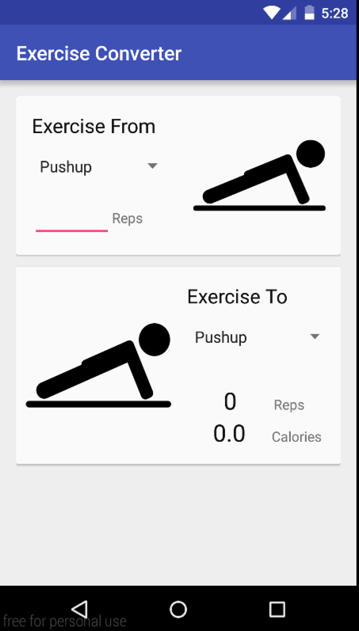

# PROG 01: Crunch Time

This is a basic exercise conversion app in which the user can input the number of repetitions or minutes and see the number of calories burned and the number of equivalent repetitions or minutes in another selected exercise.

## Authors

Daniel Li ([li.daniel@berkeley.edu](mailto:li.daniel@berkeley.edu))

## Demo Video

See [your demo video title here] (https://link_to_your_video)

## Screenshots

## Acknowledgments

* Hat tip to anyone who's code was used
Stackoverflow link cited and thanks to Eric for helping me figure out how to use android studio and cards.
* Any other support

*Feel free to enhance your README. For Markdown syntax, see [the GitHub Guides](https://guides.github.com/features/mastering-markdown/). Remove this line in your submission.*
